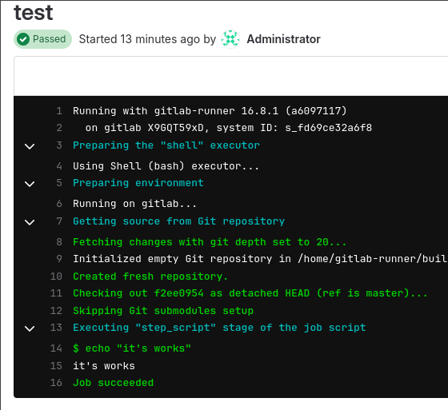
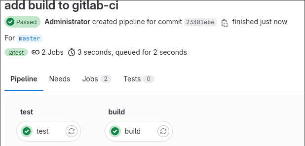
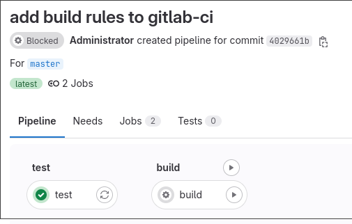
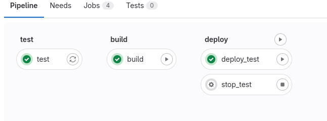
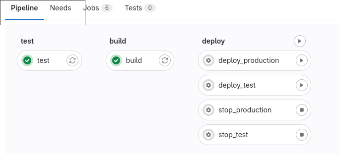

# Gitlab CI
В данном практическом занятии рассмотрим построение CI/CD конвейера
с помощью инструмента [gitlab-ci][], который является частью платформы
[gitlab][].

## Vagrant
Для работы будем использовать следующий `Vagrantfile`:
```ruby
Vagrant.configure("2") do |config|
  config.vm.define "gitlab" do |c|
    c.vm.box = "ubuntu/lunar64"
    c.vm.provider "virtualbox" do |v|
      v.cpus = 2
      v.memory = 5120
    end
    c.vm.hostname = "gitlab"
    c.vm.network "forwarded_port", guest: 8888, host: 8888
    c.vm.provision "shell", inline: <<-SHELL
      apt-get update -q
      apt-get install -yq golang-go docker.io
      usermod -a -G docker vagrant
      host="http://localhost:8888"
      curl -LO https://packages.gitlab.com/gitlab/gitlab-ce/packages/ubuntu/jammy/gitlab-ce_16.8.3-ce.0_amd64.deb/download.deb \
        && EXTERNAL_URL=$host dpkg -i download.deb && rm download.deb
      gitlab-ctl reconfigure
      pass="$(awk '/^Password/{print $2}' /etc/gitlab/initial_root_password)"
      otoken=$(curl -sH "Content-Type: application/json" "$host/oauth/token" \
        -d '{"grant_type":"password","username":"root","password":"'"$pass"'"}' \
        | jq -r '.access_token')
      ptoken=$(curl -s "$host/api/v4/users/1/personal_access_tokens" \
        -H "Authorization: Bearer $otoken" -d "name=test" -d "scopes[]=api" \
        | jq -r '.token')
      rtoken=$(curl -sH "PRIVATE-TOKEN: $ptoken" "$host/api/v4/user/runners" \
        -d "runner_type=instance_type" -d "tag_list=shared" | jq -r '.token')
      curl -LO https://packages.gitlab.com/runner/gitlab-runner/packages/ubuntu/jammy/gitlab-runner_16.8.1_amd64.deb/download.deb \
        && dpkg -i download.deb && rm download.deb \
        && gitlab-runner register --non-interactive --url $host --executor shell --token "$rtoken"
      curl -XPUT -sH "PRIVATE-TOKEN: $ptoken" -o /dev/null \
        "$host/api/v4/application/settings?auto_devops_enabled=false"
      echo "root password: $pass"
      usermod -a -G docker gitlab-runner
    SHELL
  end
end
```

Данная конфигурация развернет виртуальную машину и установит
пакеты gitlab, а также подключит [gitlab-runner]. После
развертывания gitlab должен быть доступен по адресу
[localhost:8888](http://localhost:8888/), для авторизации
необходимо использовать логин `root` и пароль, который
выводится на экран в конце развертывания, а также
его можно посмотреть в файле `/etc/gitlab/initial_root_password`.

## New Project
Создадим новый пустой проект `test-ci` на странице
[projects/new](http://localhost:8888/projects/new#blank_project)
и склонируем на виртуальную машину:
```console
$ git clone git@localhost:root/test-ci.git
Cloning into 'test-ci'...
warning: You appear to have cloned an empty repository.
$ cd test-ci/
$ ls -a
.  ..  .git
```
На текущий момент наш репозиторий пустой, добавим в него
файл `.gitlab-ci.yml` с описанием простого пайплайна, чтобы
проверить работоспособность [gitlab-ci][]:
```yaml
stages:
- test

test:
  stage: test
  script:
    - echo "it's works"
```
Сделаем коммит и запушим репозиторий:
```console
$ git add .gitlab-ci.yml
$ git commit -m 'init'
[master (root-commit) f2ee095] init
 1 file changed, 7 insertions(+)
 create mode 100644 .gitlab-ci.yml
$ git push
Enumerating objects: 3, done.
Counting objects: 100% (3/3), done.
Delta compression using up to 2 threads
Compressing objects: 100% (2/2), done.
Writing objects: 100% (3/3), 259 bytes | 129.00 KiB/s, done.
Total 3 (delta 0), reused 0 (delta 0), pack-reused 0
To localhost:root/test-ci.git
 * [new branch]      master -> master
```
После чего в описании последнего коммита будет виден статус выполнения
пайплайна, в данном случае отмеченного зеленой галочкой:

Перейдя по ней можно получить более подробное описание выполнения пайплайна,
либо перейдя из левой панели в разделе **Build**:


Перейдя по статусу `Passed` можно увидеть из каких шагов состоял пайплайн
и отдельно рассмотреть каждый шаг:


Перейдя в шаг `test` можно увидеть лог выполнения:



## Test Stage
Хорошей практикой при разработке приложений является запуск тестов после пуша,
чтобы разработчик знал, что при изменении функционала тесты все также проходят.
Создадим простое приложение `main.go` и тест к нему `main_test.go`:
```golang
package main

import (
        "log"
        "net/http"
)

func Handler(w http.ResponseWriter, r *http.Request) {
        w.WriteHeader(http.StatusOK)
        w.Write([]byte("Hello!\n"))
}

func main() {
        if err := http.ListenAndServe("0.0.0.0:8080", http.HandlerFunc(Handler));err != nil {
                log.Fatal(err)
        }
}
```

```golang
package main

import (
        "net/http"
        "net/http/httptest"
        "testing"
)

func TestHandler(t *testing.T) {
        req, err := http.NewRequest("GET", "/", nil)
        if err != nil {
                t.Fatal(err)
        }

        rec := httptest.NewRecorder()

        http.HandlerFunc(Handler).ServeHTTP(rec, req)
        if rec.Code != http.StatusOK {
                t.Errorf(
                        "wrong status code: want %v got %v",
                        http.StatusOK, rec.Code,
                )
        }

        if rec.Body.String() != "Hello!\n" {
                t.Errorf("wrong body: got %s", rec.Body.String())
        }
}
```

А также изменим скрипт в `.gitlab-ci.yml`:
```yaml
stages:
- test

test:
  stage: test
  script:
    - go test
```

И отправим в репозиторий, создав модуль:
```console
$ go mod init test
go: creating new go.mod: module test
go: to add module requirements and sums:
        go mod tidy
$ git add .
$ git commit -m 'add test ci'
[master cf6ec4d] add test ci
 4 files changed, 50 insertions(+), 1 deletion(-)
 create mode 100644 go.mod
 create mode 100644 main.go
 create mode 100644 main_test.go
$ git push
Enumerating objects: 8, done.
Counting objects: 100% (8/8), done.
Delta compression using up to 2 threads
Compressing objects: 100% (5/5), done.
Writing objects: 100% (6/6), 909 bytes | 454.00 KiB/s, done.
Total 6 (delta 0), reused 0 (delta 0), pack-reused 0
To localhost:root/test-ci.git
   f2ee095..cf6ec4d  master -> master
```

В результате выполнения задачи `test` нашего пайплайна увидим результат теста:
```console
Running with gitlab-runner 16.8.1 (a6097117)
  on gitlab X9GQT59xD, system ID: s_fd69ce32a6f8
Preparing the "shell" executor 00:00
Using Shell (bash) executor...
Preparing environment 00:00
Running on gitlab...
Getting source from Git repository 00:01
Fetching changes with git depth set to 20...
Reinitialized existing Git repository in /home/gitlab-runner/builds/X9GQT59xD/0/root/test-ci/.git/
Checking out cf6ec4d7 as detached HEAD (ref is master)...
Skipping Git submodules setup
Executing "step_script" stage of the job script 00:01
$ go test
PASS
ok  	test	0.004s
Job succeeded
```

[Gitlab-ci][] [позволяет производить различную обработку результатов
тестов][gitlab-ci-testing]. Попробуем добавить отображение процента покрытия,
добавив параметр `coverage` в `.gitlab-ci.yml`:
```yaml
stages:
- test

test:
  stage: test
  script:
    - go test -cover
  coverage: '/coverage: (\d+.\d+)% of statements$/'
```
В данном скрипте утилита `go test` выведет информацию о покрытии,
а с помощью регулярного выражение в параметре `coverage` gitlab сможет
его считать и отобразить. Запушим данные изменения и посмотрим результат:
```console
Executing "step_script" stage of the job script 00:01
$ go test -cover
PASS
	test	coverage: 50.0% of statements
ok  	test	0.004s
Job succeeded
```


## Build Stage
Добавим процесс сборки нашего приложения новым шагом в `.gitlab-ci.yml`:
```yaml
stages:
- test
- build


test:
  stage: test
  script:
    - go test -cover
  coverage: '/coverage: (\d+.\d+)% of statements$/'

build:
  stage: build
  script:
    - go build
```
И отправим в репозиторий, после чего у нас появится новая стадия:


Но вероятно нам не потребуется делать сборку каждый коммит. Добавим правила,
чтобы сборка выполнялась только при наличии тега, либо при ручном запуске:
```yaml
stages:
- test
- build

test:
  stage: test
  script:
    - go test -cover
  coverage: '/coverage: (\d+.\d+)% of statements$/'

build:
  stage: build
  script:
    - go build
  rules:
    - if: $CI_COMMIT_TAG
    - when: manual
```

Теперь после пуша сборка не запустится сама:


И ее можно будет запустить вручную:


Работать с бинарными исполняемыми файлами напрямую после сборки не очень удобно,
переделаем процесс сборки, чтобы в результате получался docker образ. Добавим
в репозиторий `Dockerfile`:
```dockerfile
FROM golang:1.22-alpine as builder

WORKDIR /usr/src

COPY . .
RUN go build -o /usr/src/app

FROM scratch
COPY --from=builder /usr/src/app /app

CMD ["/app"]
```

А скрипт сборки в `.gitlab-ci.yml` изменим следующим образом:
```yaml
stages:
- test
- build

test:
  stage: test
  script:
    - go test -cover
  coverage: '/coverage: (\d+.\d+)% of statements$/'

build:
  stage: build
  script:
    - docker build -t test:${CI_COMMIT_TAG:-$CI_COMMIT_SHORT_SHA} .
  rules:
    - if: $CI_COMMIT_TAG
    - when: manual
```

Данный скрипт после сборки проставит образу тег соответствующий тегу в гит
репозитории, либо, при его отсутствии, короткий хэш коммита.

После пуша запустим сборку вручную:
```console
Executing "step_script" stage of the job script 00:21
$ docker build -t test:${CI_COMMIT_TAG:-$CI_COMMIT_SHORT_SHA} .
DEPRECATED: The legacy builder is deprecated and will be removed in a future release.
            Install the buildx component to build images with BuildKit:
            https://docs.docker.com/go/buildx/
Step 1/7 : FROM golang:1.22-alpine as builder
 ---> a2742f74d90f
Step 2/7 : WORKDIR /usr/src
 ---> Using cache
 ---> b99e933ad4c2
Step 3/7 : COPY . .
 ---> faa8e15e14c1
Step 4/7 : RUN go build -o /usr/src/app
 ---> Running in 8cb8d80d21ac
Removing intermediate container 8cb8d80d21ac
 ---> d71d3c810c82
Step 5/7 : FROM scratch
 ---> 
Step 6/7 : COPY --from=builder /usr/src/app /app
 ---> 5cf470e9d810
Step 7/7 : CMD ["/app"]
 ---> Running in 9a223691c8c6
Removing intermediate container 9a223691c8c6
 ---> 3a194e61f59b
Successfully built 3a194e61f59b
Successfully tagged test:523f63cb
Job succeeded
```

На виртуальной машине можно увидеть собранный образ:
```console
$ docker images
REPOSITORY   TAG           IMAGE ID       CREATED         SIZE
test         523f63cb      3a194e61f59b   5 minutes ago   6.95MB
golang       1.22-alpine   a2742f74d90f   3 weeks ago     230MB
```

## Deploy Stage
### Test
После сборки возможно нам захочется произвести деплой приложения в тестовую
среду, добавим стадию деплоя описав запуск и остановку в тестовой среде:
```yaml
stages:
- test
- build
- deploy

test:
  stage: test
  script:
    - go test -cover
  coverage: '/coverage: (\d+.\d+)% of statements$/'

build:
  stage: build
  script:
    - docker build -t test:${CI_COMMIT_TAG:-$CI_COMMIT_SHORT_SHA} .
  rules:
    - if: $CI_COMMIT_TAG
    - when: manual

deploy_test:
  stage: deploy
  script:
    - docker run -p 8000:8080 -d --name test test:${CI_COMMIT_TAG:-$CI_COMMIT_SHORT_SHA}
  environment:
    name: test
    on_stop: stop_test
  rules:
    - when: manual

stop_test:
  stage: deploy
  script:
    - docker rm -f test
  environment:
    name: test
    action: stop
  rules:
    - when: manual
```

После чего у нас появится новая стадия в пайплайне:


Запустим сборку и деплой:



После чего на сервере увидим результат:
```console
$ docker ps
CONTAINER ID   IMAGE           COMMAND   CREATED          STATUS          PORTS                                       NAMES
6b6e6c9786fc   test:017e1343   "/app"    51 seconds ago   Up 50 seconds   0.0.0.0:8000->8080/tcp, :::8000->8080/tcp   test
$ curl localhost:8000
Hello!
```

### Prod
Также можем добавить деплой в продуктивную среду в этой же стадии, но сделаем
обязательными правилами наличие тега с ручным запуском:
```yaml
stages:
- test
- build
- deploy

test:
  stage: test
  script:
    - go test -cover
  coverage: '/coverage: (\d+.\d+)% of statements$/'

build:
  stage: build
  script:
    - docker build -t test:${CI_COMMIT_TAG:-$CI_COMMIT_SHORT_SHA} .
  rules:
    - if: $CI_COMMIT_TAG
    - when: manual

deploy_test:
  stage: deploy
  script:
    - docker run -p 8000:8080 -d --name test test:${CI_COMMIT_TAG:-$CI_COMMIT_SHORT_SHA}
  environment:
    name: test
    on_stop: stop_test
  rules:
    - when: manual

stop_test:
  stage: deploy
  script:
    - docker rm -f test
  environment:
    name: test
    action: stop
  rules:
    - when: manual

deploy_production:
  stage: deploy
  script:
    - docker run -p 9000:8080 -d --name prod test:$CI_COMMIT_TAG
  environment:
    name: production
    on_stop: stop_production
  rules:
    - if: $CI_COMMIT_TAG
      when: manual

stop_production:
  stage: deploy
  script:
    - docker rm -f prod
  environment:
    name: production
    action: stop
  rules:
    - if: $CI_COMMIT_TAG
      when: manual
```

На текущий момент в пайплайне не появится возможность деплоя в продуктивную
среду, так как необходимо иметь тег:


Добавим и запушим тег:
```
$ git tag v0.0.1
$ git push origin v0.0.1
Total 0 (delta 0), reused 0 (delta 0), pack-reused 0
To localhost:root/test-ci.git
 * [new tag]         v0.0.1 -> v0.0.1
```

После чего появится новый пайплайн:



Как видно сборка запустилась автоматически при наличии тега, запустим теперь
деплой в прод и после проверим результат:
```console
$ docker ps
CONTAINER ID   IMAGE           COMMAND   CREATED              STATUS              PORTS                                       NAMES
0929d8d7b92a   test:v0.0.1     "/app"    About a minute ago   Up About a minute   0.0.0.0:9000->8080/tcp, :::9000->8080/tcp   prod
6b6e6c9786fc   test:017e1343   "/app"    32 minutes ago       Up 32 minutes       0.0.0.0:8000->8080/tcp, :::8000->8080/tcp   test
$ curl localhost:9000
Hello!
```

Также управление средами развертки можно управлять со страницы
[Operate/Environments](http://localhost:8888/root/test-ci/-/environments):


Таким образом с помощью пайплайна `gitlab-ci` можно построить удобный процесс
разработки, тестирования и развертывания.


[gitlab]:https://docs.gitlab.com/ee/
[gitlab-ci]:https://docs.gitlab.com/ee/ci/
[gitlab-runner]:https://docs.gitlab.com/runner/
[gitlab-ci-testing]:https://docs.gitlab.com/ee/ci/testing/
