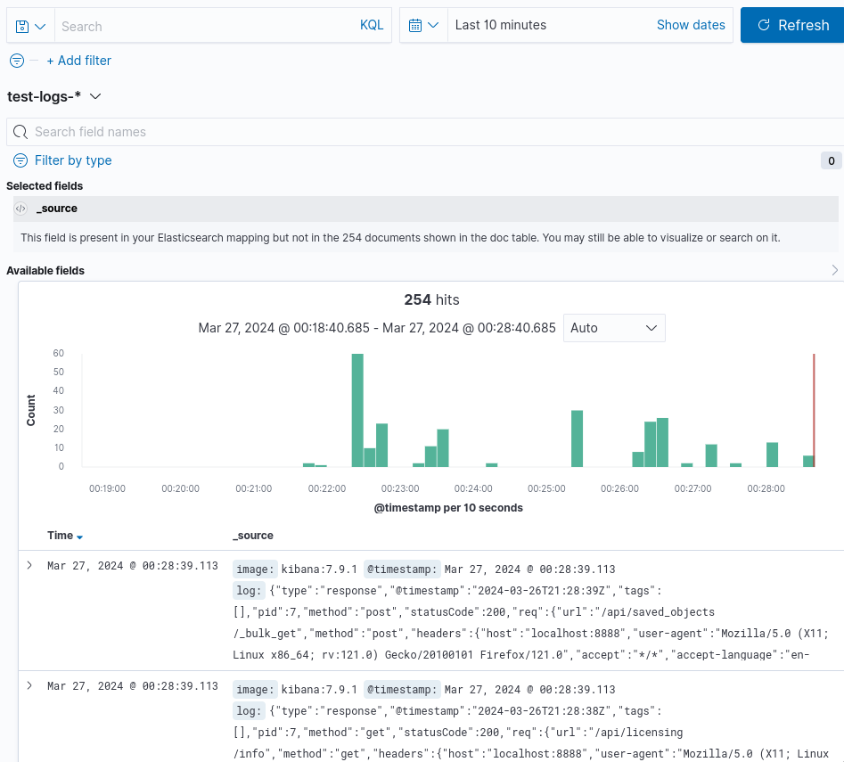
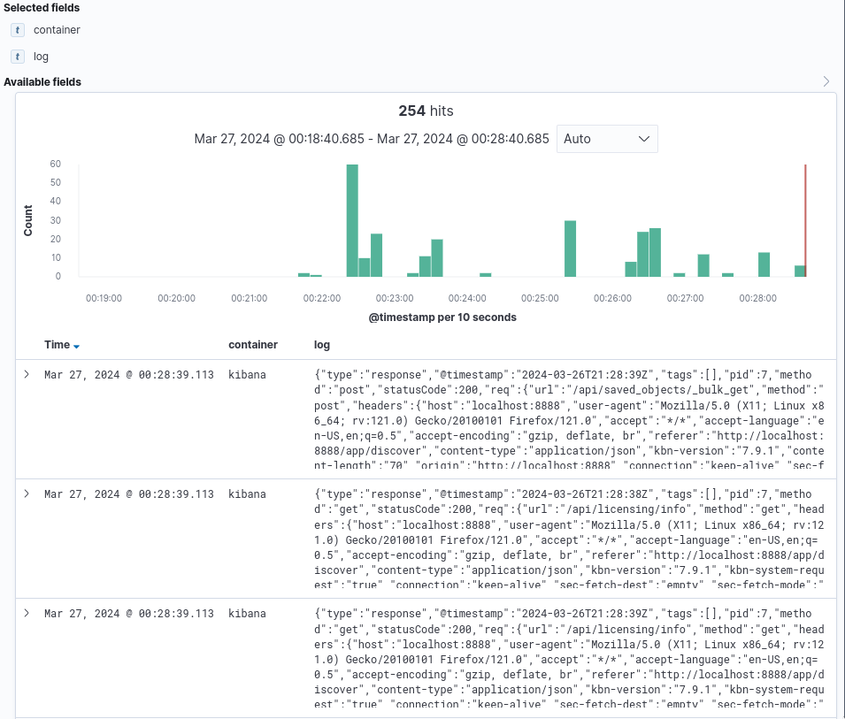
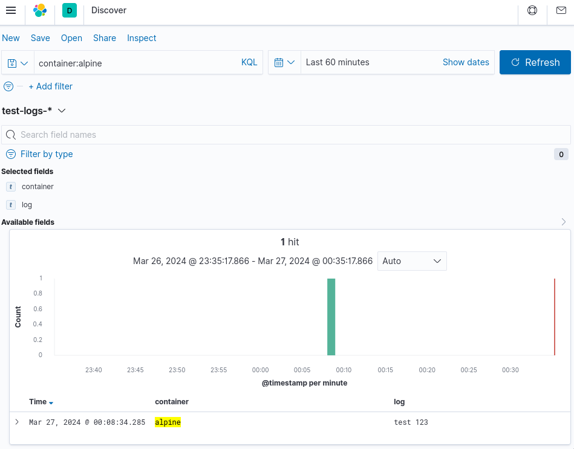
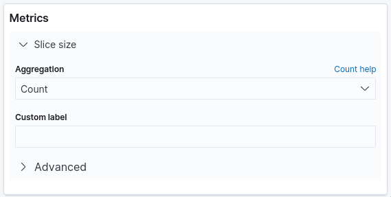
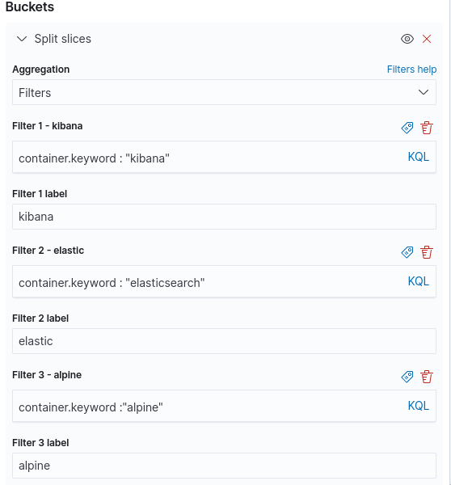

# ELK Stack
Данное практическое занятие посвящено базовому взаимодействию со стеком [ELK][].

## Vagrant
Для работы будем использовать следующий `Vagrantfile`:
```ruby
Vagrant.configure("2") do |config|
  config.vm.define "prometheus" do |c|
    c.vm.box = "ubuntu/lunar64"
    c.vm.hostname = "prometheus"
    c.vm.network "forwarded_port", guest: 8888, host: 8888
    c.vm.network "forwarded_port", guest: 8889, host: 8889
    c.vm.provision "shell", inline: <<-SHELL
      apt-get update -q
      apt-get install -yq docker.io docker-compose-v2
      usermod -a -G docker vagrant
    SHELL
  end
end
```
Данная конфигурация установит на виртуальную машину [docker][] и
[docker compose][docker-compose], с помощью которых в дальнейшем будут
развернуты остальные компоненты.

## Elasticsearch
Запустим [elasticsearch][], для этого зададим его конфигурацию `elasticsearch.yml`:
```yaml
cluster.name: "elasticsearch"
network.host: localhost
```
И `compose.yaml`:
```yaml
version: '3'
services:
  elasticsearch:
    image: elasticsearch:7.9.1
    container_name: elasticsearch
    ports:
      - "8889:9200"
      - "9300:9300"
    volumes:
      - test_data:/usr/share/elasticsearch/data/
      - ./elasticsearch.yml:/usr/share/elasticsearch/config/elasticsearch.yml
    environment:
      - discovery.type=single-node
      - http.host=0.0.0.0
      - transport.host=0.0.0.0
      - xpack.security.enabled=false
      - xpack.monitoring.enabled=false
      - cluster.name=elasticsearch
      - bootstrap.memory_lock=true
      - ES_JAVA_OPTS=-Xms256m -Xmx256m
    networks:
      - elk

networks:
  elk:
    driver: bridge

volumes:
  test_data:
```

После чего запустим:
```console
$ docker compose up -d
[+] Running 3/3
 ✔ Network vagrant_elk         Created                                                 0.1s
 ✔ Volume "vagrant_test_data"  Created                                                 0.0s
 ✔ Container elasticsearch     Started                                                 1.5s
```

Теперь [elasticsearch][] доступен по адресу `localhost:8889`, можем взаимодействовать
с его api утилитой `curl`. Для удобочитаемого вывода в api есть специальная группа
[`_cat`][cat] в которой можно получить различную информацию о кластере:
```console
$ curl localhost:8889/_cat
=^.^=
/_cat/allocation
/_cat/shards
/_cat/shards/{index}
/_cat/master
/_cat/nodes
/_cat/tasks
/_cat/indices
/_cat/indices/{index}
/_cat/segments
/_cat/segments/{index}
/_cat/count
/_cat/count/{index}
/_cat/recovery
/_cat/recovery/{index}
/_cat/health
/_cat/pending_tasks
/_cat/aliases
/_cat/aliases/{alias}
/_cat/thread_pool
/_cat/thread_pool/{thread_pools}
/_cat/plugins
/_cat/fielddata
/_cat/fielddata/{fields}
/_cat/nodeattrs
/_cat/repositories
/_cat/snapshots/{repository}
/_cat/templates
/_cat/ml/anomaly_detectors
/_cat/ml/anomaly_detectors/{job_id}
/_cat/ml/trained_models
/_cat/ml/trained_models/{model_id}
/_cat/ml/datafeeds
/_cat/ml/datafeeds/{datafeed_id}
/_cat/ml/data_frame/analytics
/_cat/ml/data_frame/analytics/{id}
/_cat/transforms
/_cat/transforms/{transform_id}
$ curl localhost:8889/_cat/health
1711480438 19:13:58 elasticsearch green 1 1 0 0 0 0 0 0 - 100.0%
$ curl localhost:8889/_cat/health?v=true
epoch      timestamp cluster       status node.total node.data shards pri relo init unassign pending_tasks max_task_wait_time active_shards_percent
1711480449 19:14:09  elasticsearch green           1         1      0   0    0    0        0             0                  -                100.0%
$ curl localhost:8889/_cat/health?help
epoch                 | t,time                                   | seconds since 1970-01-01 00:00:00
timestamp             | ts,hms,hhmmss                            | time in HH:MM:SS
cluster               | cl                                       | cluster name
status                | st                                       | health status
node.total            | nt,nodeTotal                             | total number of nodes
node.data             | nd,nodeData                              | number of nodes that can store data
shards                | t,sh,shards.total,shardsTotal            | total number of shards
pri                   | p,shards.primary,shardsPrimary           | number of primary shards
relo                  | r,shards.relocating,shardsRelocating     | number of relocating nodes
init                  | i,shards.initializing,shardsInitializing | number of initializing nodes
unassign              | u,shards.unassigned,shardsUnassigned     | number of unassigned shards
pending_tasks         | pt,pendingTasks                          | number of pending tasks
max_task_wait_time    | mtwt,maxTaskWaitTime                     | wait time of longest task pending
active_shards_percent | asp,activeShardsPercent                  | active number of shards in percent
$ curl localhost:8889/_cat/indices?v=true
health status index uuid pri rep docs.count docs.deleted store.size pri.store.size
```
Как видно, на текущий момент индексы отсутствуют. Создадим новый индекс:
```console
$ curl -XPUT localhost:8889/test
{"acknowledged":true,"shards_acknowledged":true,"index":"test"}
$ curl localhost:8889/_cat/indices?v=true
health status index uuid                   pri rep docs.count docs.deleted store.size pri.store.size
yellow open   test  ehKCGlmsRMG9a3ZC1nf13g   1   1          0            0       208b           208b
$ curl -s localhost:8889/test/_search | jq
{
  "took": 5,
  "timed_out": false,
  "_shards": {
    "total": 1,
    "successful": 1,
    "skipped": 0,
    "failed": 0
  },
  "hits": {
    "total": {
      "value": 0,
      "relation": "eq"
    },
    "max_score": null,
    "hits": []
  }
}
```
Сейчас он пуст, добавим в него документ:
```console
$ curl -sH 'Content-Type: application/json' localhost:8889/test/_doc/ -d '{"message":"hello"}' | jq
{
  "_index": "test",
  "_type": "_doc",
  "_id": "Us0-fI4BJUxYkdJGSOu-",
  "_version": 1,
  "result": "created",
  "_shards": {
    "total": 2,
    "successful": 1,
    "failed": 0
  },
  "_seq_no": 0,
  "_primary_term": 1
}
$ curl -s localhost:8889/test/_search | jq
{
  "took": 1045,
  "timed_out": false,
  "_shards": {
    "total": 1,
    "successful": 1,
    "skipped": 0,
    "failed": 0
  },
  "hits": {
    "total": {
      "value": 1,
      "relation": "eq"
    },
    "max_score": 1,
    "hits": [
      {
        "_index": "test",
        "_type": "_doc",
        "_id": "Us0-fI4BJUxYkdJGSOu-",
        "_score": 1,
        "_source": {
          "message": "hello"
        }
      }
    ]
  }
}
```
Поиск без аргументов выводит все документы в индексе. Добавим еще один документ
и попробуем сделать поисковый запрос с помощью параметра `q`:
```console
$ curl -sH 'Content-Type: application/json' localhost:8889/test/_doc/ -d '{"message":"hello world"}' | jq
{
  "_index": "test",
  "_type": "_doc",
  "_id": "Zs1NfI4BJUxYkdJGDOtc",
  "_version": 1,
  "result": "created",
  "_shards": {
    "total": 2,
    "successful": 1,
    "failed": 0
  },
  "_seq_no": 1,
  "_primary_term": 1
}
$ curl -s localhost:8889/test/_search?q="hello" | jq
{
  "took": 6,
  "timed_out": false,
  "_shards": {
    "total": 1,
    "successful": 1,
    "skipped": 0,
    "failed": 0
  },
  "hits": {
    "total": {
      "value": 2,
      "relation": "eq"
    },
    "max_score": 0.6931471,
    "hits": [
      {
        "_index": "test",
        "_type": "_doc",
        "_id": "Us0-fI4BJUxYkdJGSOu-",
        "_score": 0.6931471,
        "_source": {
          "message": "hello"
        }
      },
      {
        "_index": "test",
        "_type": "_doc",
        "_id": "Zs1NfI4BJUxYkdJGDOtc",
        "_score": 0.160443,
        "_source": {
          "message": "hello world"
        }
      }
    ]
  }
}
$ curl -s localhost:8889/test/_search?q="world" | jq
{
  "took": 6,
  "timed_out": false,
  "_shards": {
    "total": 1,
    "successful": 1,
    "skipped": 0,
    "failed": 0
  },
  "hits": {
    "total": {
      "value": 1,
      "relation": "eq"
    },
    "max_score": 0.60996956,
    "hits": [
      {
        "_index": "test",
        "_type": "_doc",
        "_id": "Zs1NfI4BJUxYkdJGDOtc",
        "_score": 0.60996956,
        "_source": {
          "message": "hello world"
        }
      }
    ]
  }
}
$ curl -s 'localhost:8889/test/_search?q=message.keyword:"hello"' | jq
{
  "took": 1,
  "timed_out": false,
  "_shards": {
    "total": 1,
    "successful": 1,
    "skipped": 0,
    "failed": 0
  },
  "hits": {
    "total": {
      "value": 1,
      "relation": "eq"
    },
    "max_score": 0.6931471,
    "hits": [
      {
        "_index": "test",
        "_type": "_doc",
        "_id": "Us0-fI4BJUxYkdJGSOu-",
        "_score": 0.6931471,
        "_source": {
          "message": "hello"
        }
      }
    ]
  }
}
$ curl -s localhost:8889/test/_search?q=/.*world/ | jq
{
  "took": 14,
  "timed_out": false,
  "_shards": {
    "total": 1,
    "successful": 1,
    "skipped": 0,
    "failed": 0
  },
  "hits": {
    "total": {
      "value": 1,
      "relation": "eq"
    },
    "max_score": 1,
    "hits": [
      {
        "_index": "test",
        "_type": "_doc",
        "_id": "Zs1NfI4BJUxYkdJGDOtc",
        "_score": 1,
        "_source": {
          "message": "hello world"
        }
      }
    ]
  }
}
```
Как видно [elasticsearch][] позволяет делать запросы различного вида для поиска в индексе.
В конце удалим наш индекс:
```console
$ curl -XDELETE localhost:8889/test
{"acknowledged":true}
$ curl localhost:8889/_cat/indices?v=true
health status index uuid pri rep docs.count docs.deleted store.size pri.store.size
```

## Logstash
Развернем также [logstash][], который позволяет принимать, обрабатывать и записывать
данные в [elasticsearch][]. Для этого определим два конфигурационных файла
`logstash.yaml` и `logstash.conf`:
```yaml
http.host: 0.0.0.0
xpack.monitoring.elasticsearch.hosts: ["http://elasticsearch:9200"]
```
```
input {
  file {
    path => ["/var/lib/docker/containers/*/*.log"]
  }
}

filter {
}

output {
   elasticsearch {
   hosts => "http://elasticsearch:9200"
   index => "test-logs-%{+YYYY.MM.DD}"
  }
}
```
Данная конфигурация позволит считывать логи контейнеров и отправлять их elastic. Но для
этого потребуется изменить конфигурацию [docker][] демона `/etc/docker/daemon.json`:
```json
{
  "log-driver": "json-file",
  "log-opts": {
    "max-size": "10m",
    "max-file": "3",
    "tag": "{{.ImageName}}/{{.Name}}"
  }
}
```
После чего потребуется перезапустить его командой:
```console
sudo systemctl restart docker
```

Теперь опишем сервис [logstash][] в `compose.yaml`:
```yaml
version: '3'
services:
  elasticsearch:
    image: elasticsearch:7.9.1
    container_name: elasticsearch
    ports:
      - "8889:9200"
      - "9300:9300"
    volumes:
      - test_data:/usr/share/elasticsearch/data/
      - ./elasticsearch.yml:/usr/share/elasticsearch/config/elasticsearch.yml
    environment:
      - discovery.type=single-node
      - http.host=0.0.0.0
      - transport.host=0.0.0.0
      - xpack.security.enabled=false
      - xpack.monitoring.enabled=false
      - cluster.name=elasticsearch
      - bootstrap.memory_lock=true
      - ES_JAVA_OPTS=-Xms256m -Xmx256m
    networks:
      - elk

  logstash:
    image: logstash:7.9.1
    container_name: logstash
    user: "0"
    ports:
      - "5044:5044/udp"
      - "9600:9600"
    volumes:
      - ./logstash.conf:/usr/share/logstash/pipeline/logstash.conf
      - ./logstash.yml:/usr/share/logstash/config/logstash.yml
      - ls_data:/usr/share/logstash/data
      - /var/lib/docker/containers:/var/lib/docker/containers

    networks:
      - elk
    depends_on:
      - elasticsearch

networks:
  elk:
    driver: bridge

volumes:
  test_data:
  ls_data:
```

И запустим:
```console
$ docker compose up -d
[+] Running 3/3
 ✔ Volume "vagrant_ls_data"  Created                                                   0.0s
 ✔ Container elasticsearch   Started                                                   0.3s
 ✔ Container logstash        Started                                                   0.6s
```

После запуска [logstash][] создаст свой индекс и начнет писать в него сообщения:
```console
$ curl localhost:8889/_cat/indices?v=true
health status index                uuid                   pri rep docs.count docs.deleted store.size pri.store.size
yellow open   test-logs-2024.03.86 2hpFb0ffRgmgtnyMI4_plw   1   1          4            0     10.2kb         10.2kb
$ curl -s localhost:8889/test-logs-2024.03.86/_search?size=1 | jq
{
  "took": 1,
  "timed_out": false,
  "_shards": {
    "total": 1,
    "successful": 1,
    "skipped": 0,
    "failed": 0
  },
  "hits": {
    "total": {
      "value": 4,
      "relation": "eq"
    },
    "max_score": 1,
    "hits": [
      {
        "_index": "test-logs-2024.03.86",
        "_type": "_doc",
        "_id": "4ViDfI4BPacsZSlTAf5s",
        "_score": 1,
        "_source": {
          "message": "{\"log\":\"[2024-03-26T20:45:42,599][INFO ][logstash.agent           ] Successfully started Logstash API endpoint {:port=\\u003e9600}\\n\",\"stream\":\"stdout\",\"attrs\":{\"tag\":\"logstash:7.9.1/logstash\"},\"time\":\"2024-03-26T20:45:42.607986242Z\"}",
          "@timestamp": "2024-03-26T20:45:43.682Z",
          "path": "/var/lib/docker/containers/34fa05cc4d33e34a8ef0b385419f3714773a6e12b4d5a4919a4aebf90a13155a/34fa05cc4d33e34a8ef0b385419f3714773a6e12b4d5a4919a4aebf90a13155a-json.log",
          "host": "34fa05cc4d33",
          "@version": "1"
        }
      }
    ]
  }
}
```
Можем запустить свой контейнер, который будет только выводить введенный текст:
```console
$ docker run -it --name alpine alpine sh -c 'cat >/dev/null'
Unable to find image 'alpine:latest' locally
latest: Pulling from library/alpine
4abcf2066143: Pull complete
Digest: sha256:c5b1261d6d3e43071626931fc004f70149baeba2c8ec672bd4f27761f8e1ad6b
Status: Downloaded newer image for alpine:latest
hello

```
После переноса строки можно завершить ввод комбинацией `ctrl+d` и попытаться найти
наш текст в индексе:
```console
$ curl -s 'localhost:8889/test-logs-2024.03.86/_search?size=1&sort=@timestamp:desc' | jq
{
  "took": 1,
  "timed_out": false,
  "_shards": {
    "total": 1,
    "successful": 1,
    "skipped": 0,
    "failed": 0
  },
  "hits": {
    "total": {
      "value": 5,
      "relation": "eq"
    },
    "max_score": null,
    "hits": [
      {
        "_index": "test-logs-2024.03.86",
        "_type": "_doc",
        "_id": "6FiKfI4BPacsZSlT9v5L",
        "_score": null,
        "_source": {
          "message": "{\"log\":\"hello\\r\\n\",\"stream\":\"stdout\",\"attrs\":{\"tag\":\"alpine/alpine\"},\"time\":\"2024-03-26T20:54:24.873049246Z\"}",
          "@timestamp": "2024-03-26T20:54:25.503Z",
          "path": "/var/lib/docker/containers/a7320f962f5b0a7a087831b685b38517a1ef8c84d64ce6018d160b54bbdeb07f/a7320f962f5b0a7a087831b685b38517a1ef8c84d64ce6018d160b54bbdeb07f-json.log",
          "host": "34fa05cc4d33",
          "@version": "1"
        },
        "sort": [
          1711486465503
        ]
      }
    ]
  }
}
```

Помимо получения из файла и отправки в индекс в конфигурации [logstash][] можно также
задать обработку данных в параметре `filter`. Как видно в `message` нашего документа
содержится текст в формате `json`, в котором по ключу `attrs.tag` хранится информация
об образе и имени контейнера. Попробуем достать эти данные и положить в отдельные поля,
для этого дополним `logstash.conf`:
```
input {
  file {
    path => ["/var/lib/docker/containers/*/*.log"]
  }
}

filter {
  json {
    source => "message"
  }
  mutate {
    split => { "[attrs][tag]" => "/" }
  }
  mutate {
    add_field => {
      "image" => "%{[attrs][tag][0]}"
      "container" => "%{[attrs][tag][1]}"
    }
    remove_field => ["attrs", "message"]
  }
}

output {
   elasticsearch {
   hosts => "http://elasticsearch:9200"
   index => "test-logs-%{+YYYY.MM.DD}"
  }
}
```
После чего перезапустим контейнеры:
```console
$ docker compose up -d --force-recreate
[+] Running 2/2
 ✔ Container elasticsearch  Started                                                    2.1s
 ✔ Container logstash       Started                                                    2.0s
```

Повторно запустим тестовый контейнер:
```console
$ docker rm -f alpine
alpine
$ docker run -it --name alpine alpine sh -c 'cat >/dev/null'
test 123
```
И посмотрим как теперь выглядит документ:
```console
$ curl -s 'localhost:8889/test-logs-2024.03.86/_search?q=container:alpine' | jq
{
  "took": 22,
  "timed_out": false,
  "_shards": {
    "total": 1,
    "successful": 1,
    "skipped": 0,
    "failed": 0
  },
  "hits": {
    "total": {
      "value": 1,
      "relation": "eq"
    },
    "max_score": 1.2039728,
    "hits": [
      {
        "_index": "test-logs-2024.03.86",
        "_type": "_doc",
        "_id": "ctSXfI4BBZ7dkKnP6S3b",
        "_score": 1.2039728,
        "_source": {
          "image": "alpine",
          "@timestamp": "2024-03-26T21:08:34.285Z",
          "log": "test 123\r\n",
          "path": "/var/lib/docker/containers/ecedf32cc76a9e3d7843bee34f86a3873fd1b21a0cb9ad41689308b1051b984d/ecedf32cc76a9e3d7843bee34f86a3873fd1b21a0cb9ad41689308b1051b984d-json.log",
          "stream": "stdout",
          "@version": "1",
          "host": "12b43b1d6336",
          "time": "2024-03-26T21:08:33.97032219Z",
          "container": "alpine"
        }
      }
    ]
  }
}
$ curl -s 'localhost:8889/test-logs-2024.03.86/_search?q=container:logstash&size=1' | jq
{
  "took": 2,
  "timed_out": false,
  "_shards": {
    "total": 1,
    "successful": 1,
    "skipped": 0,
    "failed": 0
  },
  "hits": {
    "total": {
      "value": 1,
      "relation": "eq"
    },
    "max_score": 1.2039728,
    "hits": [
      {
        "_index": "test-logs-2024.03.86",
        "_type": "_doc",
        "_id": "b9SWfI4BBZ7dkKnP7y0b",
        "_score": 1.2039728,
        "_source": {
          "image": "logstash:7.9.1",
          "@timestamp": "2024-03-26T21:07:30.049Z",
          "log": "[2024-03-26T21:07:28,894][INFO ][logstash.agent           ] Successfully started Logstash API endpoint {:port=>9600}\n",
          "path": "/var/lib/docker/containers/12b43b1d6336d6e88c82405cb6e22d04a2f79750386d811af4a80f0304af225e/12b43b1d6336d6e88c82405cb6e22d04a2f79750386d811af4a80f0304af225e-json.log",
          "stream": "stdout",
          "@version": "1",
          "host": "12b43b1d6336",
          "time": "2024-03-26T21:07:28.894641313Z",
          "container": "logstash"
        }
      }
    ]
  }
}
```

## Kibana
Для удобной визуализации логов в [elasticsearch][] воспользуемся инструментом [kibana][].
Создадим конфигурацию `kibana.yml`:
```yaml
server.name: kibana
server.host: "0"
elasticsearch.hosts: [ "http://elasticsearch:9200" ]
monitoring.ui.container.elasticsearch.enabled: true
```
И дополним наш `compose.yaml`:
```yaml
version: '3'
services:
  elasticsearch:
    image: elasticsearch:7.9.1
    container_name: elasticsearch
    ports:
      - "8889:9200"
      - "9300:9300"
    volumes:
      - test_data:/usr/share/elasticsearch/data/
      - ./elasticsearch.yml:/usr/share/elasticsearch/config/elasticsearch.yml
    environment:
      - discovery.type=single-node
      - http.host=0.0.0.0
      - transport.host=0.0.0.0
      - xpack.security.enabled=false
      - xpack.monitoring.enabled=false
      - cluster.name=elasticsearch
      - bootstrap.memory_lock=true
      - ES_JAVA_OPTS=-Xms256m -Xmx256m
    networks:
      - elk

  logstash:
    image: logstash:7.9.1
    container_name: logstash
    user: "0"
    ports:
      - "5044:5044/udp"
      - "9600:9600"
    volumes:
      - ./logstash.conf:/usr/share/logstash/pipeline/logstash.conf
      - ./logstash.yml:/usr/share/logstash/config/logstash.yml
      - ls_data:/usr/share/logstash/data
      - /var/lib/docker/containers:/var/lib/docker/containers

    networks:
      - elk
    depends_on:
      - elasticsearch

  kibana:
    image: kibana:7.9.1
    container_name: kibana
    ports:
      - "8888:5601"
    volumes:
      - ./kibana.yml:/usr/share/kibana/config/kibana.yml
      - kb_data:/usr/share/kibana/data
    networks:
      - elk
    depends_on:
      - elasticsearch

networks:
  elk:
    driver: bridge

volumes:
  test_data:
  ls_data:
  kb_data:
```

После чего можем запустить:
```console
$ docker compose up -d
[+] Running 3/3
 ✔ Container elasticsearch  Running                                                    0.0s
 ✔ Container logstash       Running                                                    0.0s
 ✔ Container kibana         Started                                                    0.3s
```
[Kibana][] будет доступна по адресу [localhost:8888](http://localhost:8888), а по
адресу [localhost:8888/app/discover](http://localhost:8888/app/discover) можно будет
сделать поиск наших логов. Для этого потребуется добавить паттерн для нашего индекса:


И можно будет вернуться на страницу [/app/discover](http://localhost:8888/app/discover):



В левой панели можно выбрать поля для отображения:


Добавим поля `container` и `log`:



Поиск можно осуществлять с помощью [KQL][]:



Различные визуализации можно создавать на странице
[/app/visualize](http://localhost:8888/app/visualize). Добавим визуализацию в виде
pie chart:


После чего в правой панели зададим метрику `Count`:



И разбиение по бакетам:



Нажав кнопку `Update` увидим визуализацию, которая отображает соотношение логов
по разным контейнерам:


[elk]:https://www.elastic.co/elastic-stack
[docker]:https://docs.docker.com/engine/
[docker-compose]:https://docs.docker.com/compose/
[elasticsearch]:https://www.elastic.co/guide/en/elasticsearch/reference/current/index.html
[cat]:https://www.elastic.co/guide/en/elasticsearch/reference/current/cat.html
[logstash]:https://www.elastic.co/guide/en/logstash/current/introduction.html
[kibana]:https://www.elastic.co/guide/en/kibana/current/introduction.html
[kql]:https://www.elastic.co/guide/en/kibana/current/kuery-query.html
