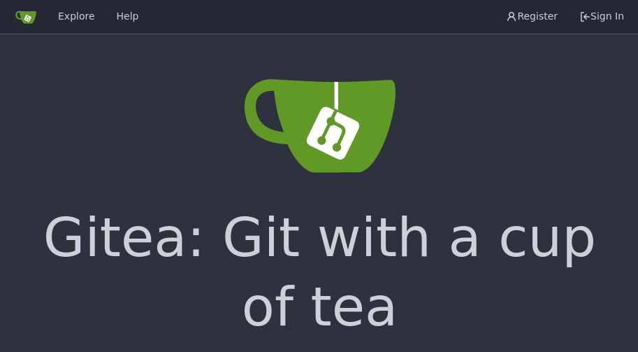
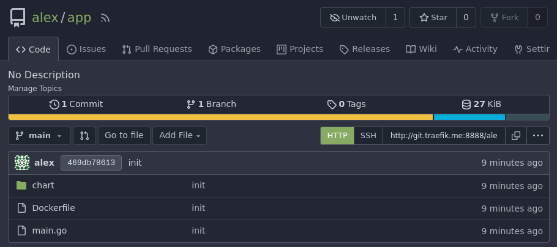
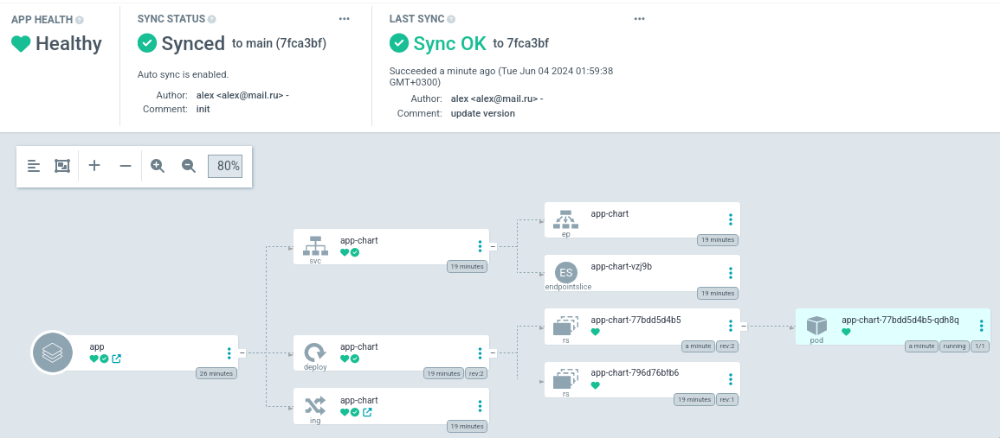
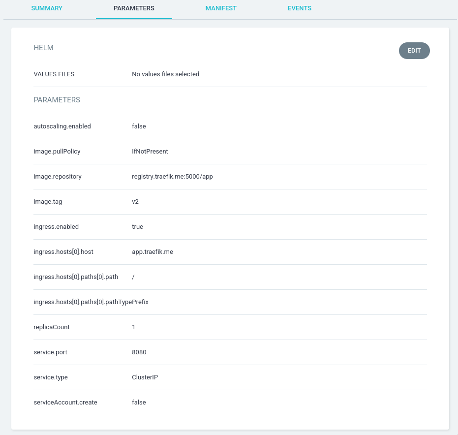
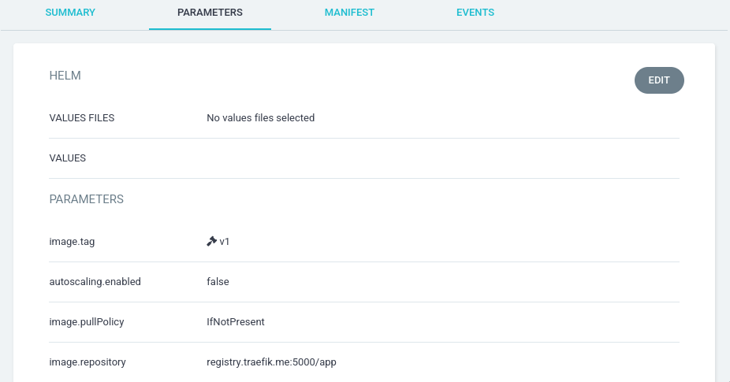

# ArgoCD GitOps
В данном практическом занятии рассмотрим возможности [argocd][] в качестве
GitOps инструмента.

## Vagrant
Для работы будем использовать следующий `Vagrantfile`:
```ruby
Vagrant.configure("2") do |config|
  config.vm.define "argocd" do |c|
    c.vm.provider "virtualbox" do |v|
      v.cpus = 2
      v.memory = 4096
    end
    c.vm.box = "ubuntu/lunar64"
    c.vm.hostname = "argocd"
    c.vm.network "forwarded_port", guest: 80, host: 8888
    c.vm.provision "shell", inline: <<-SHELL
      apt-get update -q
      apt-get install -yq docker.io docker-compose-v2
      usermod -a -G docker vagrant
      echo '{"registry-mirrors":["https:\\/\\/mirror.gcr.io"]}' > /etc/docker/daemon.json
      systemctl restart docker
      curl -LO https://dl.k8s.io/release/v1.30.0/bin/linux/amd64/kubectl
      curl -Lo ./kind https://kind.sigs.k8s.io/dl/v0.22.0/kind-linux-amd64
      curl -Lo ./argocd https://github.com/argoproj/argo-cd/releases/download/v2.11.2/argocd-linux-amd64
      curl -L https://get.helm.sh/helm-v3.15.1-linux-amd64.tar.gz | tar xvzf - --strip-components 1 linux-amd64/helm
      install -m 755 kubectl kind argocd helm /usr/local/bin/
      rm ./*
    SHELL
  end
end
```
Данная конфигурация установит на виртуальную машину [docker][], [kubectl][],
[kind][], [argocd][] и [helm][].

## Install
Для развертывания кластера с помощью [kind][] с возможностью использования
локального registry воспользуемся [скриптом][kind-registry]:

```bash
#!/bin/sh
set -o errexit

# 1. Create registry container unless it already exists
reg_name='kind-registry'
reg_port='5000'
if [ "$(docker inspect -f '{{.State.Running}}' "${reg_name}" 2>/dev/null || true)" != 'true' ]; then
  docker run \
    -d --restart=always -p "127.0.0.1:${reg_port}:5000" --network bridge --name "${reg_name}" \
    registry:2
fi

# 2. Create kind cluster with containerd registry config dir enabled
# TODO: kind will eventually enable this by default and this patch will
# be unnecessary.
#
# See:
# https://github.com/kubernetes-sigs/kind/issues/2875
# https://github.com/containerd/containerd/blob/main/docs/cri/config.md#registry-configuration
# See: https://github.com/containerd/containerd/blob/main/docs/hosts.md
cat <<EOF | kind create cluster --config=-
kind: Cluster
apiVersion: kind.x-k8s.io/v1alpha4
nodes:
- role: control-plane
  kubeadmConfigPatches:
  - |
    kind: InitConfiguration
    nodeRegistration:
      kubeletExtraArgs:
        node-labels: "ingress-ready=true"
  extraPortMappings:
  - containerPort: 80
    hostPort: 8888
    protocol: TCP
  - containerPort: 443
    hostPort: 443
    protocol: TCP
containerdConfigPatches:
- |-
  [plugins."io.containerd.grpc.v1.cri".registry]
    config_path = "/etc/containerd/certs.d"
EOF

# 3. Add the registry config to the nodes
#
# This is necessary because localhost resolves to loopback addresses that are
# network-namespace local.
# In other words: localhost in the container is not localhost on the host.
#
# We want a consistent name that works from both ends, so we tell containerd to
# alias localhost:${reg_port} to the registry container when pulling images
REGISTRY_DIR="/etc/containerd/certs.d/registry.traefik.me:${reg_port}"
for node in $(kind get nodes); do
  docker exec "${node}" mkdir -p "${REGISTRY_DIR}"
  cat <<EOF | docker exec -i "${node}" cp /dev/stdin "${REGISTRY_DIR}/hosts.toml"
[host."http://${reg_name}:5000"]
EOF
done

# 4. Connect the registry to the cluster network if not already connected
# This allows kind to bootstrap the network but ensures they're on the same network
if [ "$(docker inspect -f='{{json .NetworkSettings.Networks.kind}}' "${reg_name}")" = 'null' ]; then
  docker network connect "kind" "${reg_name}"
fi

# 5. Document the local registry
# https://github.com/kubernetes/enhancements/tree/master/keps/sig-cluster-lifecycle/generic/1755-communicating-a-local-registry
cat <<EOF | kubectl apply -f -
apiVersion: v1
kind: ConfigMap
metadata:
  name: local-registry-hosting
  namespace: kube-public
data:
  localRegistryHosting.v1: |
    host: "registry.traefik.me:${reg_port}"
    help: "https://kind.sigs.k8s.io/docs/user/local-registry/"
EOF
```

Сохраним в файл и запустим:
```console
$ ./kind.sh
Unable to find image 'registry:2' locally
2: Pulling from library/registry
619be1103602: Pull complete
862815ae87dc: Pull complete
74e12953df95: Pull complete
6f0ce73649a0: Pull complete
ef4f267ce8ed: Pull complete
Digest: sha256:4fac7a8257b1d7a86599043fcc181dfbdf9c8f57e337db763ac94b0e67c6cfb5
Status: Downloaded newer image for registry:2
9f5d46586f8b64579e5acd891fd6eef51cd2dcd67ef4ee3a36ec3e3bae7aac45
Creating cluster "kind" ...
 ✓ Ensuring node image (kindest/node:v1.29.2) 🖼
 ✓ Preparing nodes 📦
 ✓ Writing configuration 📜
 ✓ Starting control-plane 🕹️
 ✓ Installing CNI 🔌
 ✓ Installing StorageClass 💾
Set kubectl context to "kind-kind"
You can now use your cluster with:

kubectl cluster-info --context kind-kind

Thanks for using kind! 😊
configmap/local-registry-hosting created
```

Установим `ingress-nginx`, а также добавим `helm` репозитории gitea и argocd:
```console
$ kubectl apply -f https://raw.githubusercontent.com/kubernetes/ingress-nginx/main/deploy/static/provider/kind/deploy.yaml
namespace/ingress-nginx created
serviceaccount/ingress-nginx created
serviceaccount/ingress-nginx-admission created
role.rbac.authorization.k8s.io/ingress-nginx created
role.rbac.authorization.k8s.io/ingress-nginx-admission created
clusterrole.rbac.authorization.k8s.io/ingress-nginx created
clusterrole.rbac.authorization.k8s.io/ingress-nginx-admission created
rolebinding.rbac.authorization.k8s.io/ingress-nginx created
rolebinding.rbac.authorization.k8s.io/ingress-nginx-admission created
clusterrolebinding.rbac.authorization.k8s.io/ingress-nginx created
clusterrolebinding.rbac.authorization.k8s.io/ingress-nginx-admission created
configmap/ingress-nginx-controller created
service/ingress-nginx-controller created
service/ingress-nginx-controller-admission created
deployment.apps/ingress-nginx-controller created
job.batch/ingress-nginx-admission-create created
job.batch/ingress-nginx-admission-patch created
ingressclass.networking.k8s.io/nginx created
validatingwebhookconfiguration.admissionregistration.k8s.io/ingress-nginx-admission created
$ helm repo add gitea-charts https://dl.gitea.com/charts/
"gitea-charts" has been added to your repositories
$ helm repo add argo https://argoproj.github.io/argo-helm
"argo" has been added to your repositories
$ helm repo update
Hang tight while we grab the latest from your chart repositories...
...Successfully got an update from the "gitea-charts" chart repository
...Successfully got an update from the "argo" chart repository
Update Complete. ⎈Happy Helming!⎈
```

После чего установим [gitea][] с помощью утилиты [helm][] и убедимся, что
контейнеры запущены:
```console
$ helm upgrade -i gitea gitea-charts/gitea --namespace git --create-namespace \
  --set global.imageRegistry=mirror.gcr.io --set persistence.enabled=false \
  --set redis-cluster.enabled=false --set postgresql-ha.enabled=false \
  --set postgresql.enabled=true --set ingress.enabled=true \
  --set-json 'ingress.hosts[0]={"host":"git.traefik.me","paths":[{"path":"/","pathType":"Prefix"}]}'
Release "gitea" does not exist. Installing it now.
NAME: gitea
LAST DEPLOYED: Mon Jun  3 20:37:25 2024
NAMESPACE: git
STATUS: deployed
REVISION: 1
NOTES:
1. Get the application URL by running these commands:
  http://git.traefik.me/
2. Review these warnings:
  - Gitea uses 'memory' for caching which is not recommended for production use. See https://docs.gitea.com/next/administration/config-cheat-sheet#cache-cache for available options.
  - Gitea uses 'leveldb' for queue actions which is not recommended for production use. See https://docs.gitea.com/next/administration/config-cheat-sheet#queue-queue-and-queue for available options.
  - Gitea uses 'memory' for sessions which is not recommended for production use. See https://docs.gitea.com/next/administration/config-cheat-sheet#session-session for available options.
$ kubectl get po -n git
NAME                     READY   STATUS    RESTARTS   AGE
gitea-7f66d84fc7-7sfqn   1/1     Running   0          76s
gitea-postgresql-0       1/1     Running   0          76s
```
После чего интерфейс будет доступен по адресу
[git.traefik.me:8888](http://git.traefik.me:8888/):



Установим также [argocd][] с помощью [helm][] и дождемся пока поды запустятся:
```console
$ helm upgrade -i argo argo/argo-cd --namespace argo --create-namespace \
  --set dex.enabled=false --set 'server.extraArgs={--insecure}' \
  --set server.ingress.enabled=true --set server.ingress.hostname=argo.traefik.me
Release "argo" does not exist. Installing it now.
NAME: argo
LAST DEPLOYED: Mon Jun  3 20:50:10 2024
NAMESPACE: argo
STATUS: deployed
REVISION: 1
TEST SUITE: None
NOTES:
In order to access the server UI you have the following options:

1. kubectl port-forward service/argo-argocd-server -n argo 8080:443

    and then open the browser on http://localhost:8080 and accept the certificate

2. enable ingress in the values file `server.ingress.enabled` and either
      - Add the annotation for ssl passthrough: https://argo-cd.readthedocs.io/en/stable/operator-manual/ingress/#option-1-ssl-passthrough
      - Set the `configs.params."server.insecure"` in the values file and terminate SSL at your ingress: https://argo-cd.readthedocs.io/en/stable/operator-manual/ingress/#option-2-multiple-ingress-objects-and-hosts


After reaching the UI the first time you can login with username: admin and the random password generated during the installation. You can find the password by running:

kubectl -n argo get secret argocd-initial-admin-secret -o jsonpath="{.data.password}" | base64 -d

(You should delete the initial secret afterwards as suggested by the Getting Started Guide: https://argo-cd.readthedocs.io/en/stable/getting_started/#4-login-using-the-cli)
$ kubectl get po -n argo
NAME                                                     READY   STATUS      RESTARTS   AGE
argo-argocd-application-controller-0                     1/1     Running     0          114s
argo-argocd-applicationset-controller-79945d9cc8-6r865   1/1     Running     0          114s
argo-argocd-notifications-controller-64dcf79f6c-s8lrj    1/1     Running     0          114s
argo-argocd-redis-59789c768d-tpn7s                       1/1     Running     0          114s
argo-argocd-redis-secret-init-zpxtb                      0/1     Completed   0          2m17s
argo-argocd-repo-server-57b8c49d95-b9wt8                 1/1     Running     0          114s
argo-argocd-server-786c44855d-w9gn6                      1/1     Running     0          114s
```
После чего интерфейс будет доступен по адресу
[argo.traefik.me:8888](http://argo.traefik.me:8888):


## Create App
Создадим репозиторий `app` в [gitea](http://git.traefik.me:8888):


Склонируем репозиторий и создадим простое приложение и `Dockerfile` к нему:
```console
$ git clone http://git.traefik.me:8888/alex/app.git
Cloning into 'app'...
warning: You appear to have cloned an empty repository.
$ cd app
$ cat <<EOF>main.go
package main

import (
        "net/http"
)

func main() {
        http.ListenAndServe(":8080", http.HandlerFunc(
                func(w http.ResponseWriter, _ *http.Request) {
                        w.WriteHeader(http.StatusOK)
                        w.Write([]byte("hello\n"))
        }))
}
EOF
$ cat <<EOF>Dockerfile
FROM mirror.gcr.io/golang:1.21 as build

WORKDIR /src

COPY main.go /src/
RUN CGO_ENABLED=0 go build -o /bin/app ./main.go

FROM scratch
COPY --from=build /bin/app /app
CMD ["/app"]
EOF
```

После чего соберем и запушим в локальный реджестри `registry.traefik.me:5000`:
```console
$ docker build -t registry.traefik.me:5000/app:v1 .
Sending build context to Docker daemon  45.57kB
Step 1/7 : FROM mirror.gcr.io/golang:1.21 as build
 ---> 0a5922bb6e20
Step 2/7 : WORKDIR /src
 ---> Running in e76b21970668
Removing intermediate container e76b21970668
 ---> 137ecccbe70b
Step 3/7 : COPY main.go /src/
 ---> e9da6a17b049
Step 4/7 : RUN CGO_ENABLED=0 go build -o /bin/app ./main.go
 ---> Running in 73edb1a2166d
Removing intermediate container 73edb1a2166d
 ---> 67701db7cb58
Step 5/7 : FROM scratch
 --->
Step 6/7 : COPY --from=build /bin/app /app
 ---> 69ba82a41903
Step 7/7 : CMD ["/app"]
 ---> Running in b1ff3579ccbe
Removing intermediate container b1ff3579ccbe
 ---> c8c5d0269885
Successfully built c8c5d0269885
Successfully tagged registry.traefik.me:5000/app:v1
$ docker push registry.traefik.me:5000/app:v1
The push refers to repository [registry.traefik.me:5000/app]
fda33218fe64: Pushed
v1: digest: sha256:b6ec73fecc842f529e590bae6c4b6b176d0f4add5997c8e9aa46bd2e5f398466 size: 528
```

## Create Chart
Создадим также `helm` чарт в репозитории:
```console
$ helm create chart
Creating chart
$ rm -r chart/templates/tests
```
И отредактируем `chart/values.yaml`:
```yaml
replicaCount: 1
image:
  repository: registry.traefik.me:5000/app
  pullPolicy: IfNotPresent
  tag: "v1"

serviceAccount:
  create: false

autoscaling:
  enabled: false

service:
  type: ClusterIP
  port: 8080

ingress:
  enabled: true
  hosts:
    - host: app.traefik.me
      paths:
        - path: /
          pathType: Prefix
```

После чего отправим в удаленный репозиторий:
```console
$ git add .
$ git commit -m init
[main (root-commit) 469db78] init
 13 files changed, 363 insertions(+)
 create mode 100644 Dockerfile
 create mode 100644 chart/.helmignore
 create mode 100644 chart/.values.yaml.swp
 create mode 100644 chart/Chart.yaml
 create mode 100644 chart/templates/NOTES.txt
 create mode 100644 chart/templates/_helpers.tpl
 create mode 100644 chart/templates/deployment.yaml
 create mode 100644 chart/templates/hpa.yaml
 create mode 100644 chart/templates/ingress.yaml
 create mode 100644 chart/templates/service.yaml
 create mode 100644 chart/templates/serviceaccount.yaml
 create mode 100644 chart/values.yaml
 create mode 100644 main.go
$ git push
Enumerating objects: 17, done.
Counting objects: 100% (17/17), done.
Delta compression using up to 2 threads
Compressing objects: 100% (17/17), done.
Writing objects: 100% (17/17), 5.76 KiB | 1.44 MiB/s, done.
Total 17 (delta 1), reused 0 (delta 0), pack-reused 0
remote: . Processing 1 references
remote: Processed 1 references in total
To http://git.traefik.me:8888/alex/app.git
 * [new branch]      main -> main
```



## Create Argo App
Создадим приложение в [argocd][], указав внутренний git адрес:
```bash
$ kubectl create -f - <<EOF
apiVersion: argoproj.io/v1alpha1
kind: Application
metadata:
  name: app
  namespace: argo
spec:
  project: default
  source:
    repoURL: http://gitea-http.git.svc:3000/alex/app.git
    targetRevision: main
    path: chart
  destination:
    server: https://kubernetes.default.svc
    namespace: default
EOF
```
После чего получим пароль и авторизуемся в 
[веб интерфейсе](http://argo.traefik.me:8888) под пользователем `admin`:
```console
$ kubectl -n argo get secret argocd-initial-admin-secret -o jsonpath="{.data.password}" | base64 -d
UStarYkPA3nh25w0
```


Как видно [argocd][] отображает ресурсы, описанные в `helm` чарте. Нажмем кнопку
`Sync` для создания ресурсов в кластере, после чего приложение перейдет в статус
`Healthy`:


А по адресу [app.traefik.me:8888](http://app.traefik.me:8888/) будет доступно
само приложение:


## Auto-Sync
Также в интерфейсе argocd в нашем приложении по кнопке `Details` можно включить
автоматическую синхронизацию ресурсов кластера с git репозиторием


Включим ее для того, чтобы при любых изменениях в репозитории ресурсы сразу
попадали в кластер.

Изменим строку в коде приложения, чтобы по выводу была понятна версия:
```golang
package main

import (
        "net/http"
)

func main() {
        http.ListenAndServe(":8080", http.HandlerFunc(
                func(w http.ResponseWriter, _ *http.Request) {
                        w.WriteHeader(http.StatusOK)
                        w.Write([]byte("hello v2\n"))
        }))
}
```

Соберем и запушим новую версию:
```console
$ docker build -t registry.traefik.me:5000/app:v2 .
Sending build context to Docker daemon    107kB
Step 1/7 : FROM mirror.gcr.io/golang:1.21 as build
 ---> 0a5922bb6e20
Step 2/7 : WORKDIR /src
 ---> Using cache
 ---> 137ecccbe70b
Step 3/7 : COPY main.go /src/
 ---> e8d44019610a
Step 4/7 : RUN CGO_ENABLED=0 go build -o /bin/app ./main.go
 ---> Running in 4e680dcb9a7c
Removing intermediate container 4e680dcb9a7c
 ---> 6a8312d3000d
Step 5/7 : FROM scratch
 --->
Step 6/7 : COPY --from=build /bin/app /app
 ---> de7646146ed1
Step 7/7 : CMD ["/app"]
 ---> Running in b9f6a2586cba
Removing intermediate container b9f6a2586cba
 ---> fbd62922d125
Successfully built fbd62922d125
Successfully tagged registry.traefik.me:5000/app:v2
$ docker push registry.traefik.me:5000/app:v2
The push refers to repository [registry.traefik.me:5000/app]
f9ea5c2db5d8: Pushed
v2: digest: sha256:d33a410af15be7f43416ff61ee3cb2aa947297aeaadfef3a043973ba6caaa0fc size: 528
```

А в файле `chart/values.yaml` укажем новую версию:
```yaml
replicaCount: 1
image:
  repository: registry.traefik.me:5000/app
  pullPolicy: IfNotPresent
  tag: "v2"

serviceAccount:
  create: false

autoscaling:
  enabled: false

service:
  type: ClusterIP
  port: 8080

ingress:
  enabled: true
  hosts:
    - host: app.traefik.me
      paths:
        - path: /
          pathType: Prefix
```
После чего отправим изменения в удаленный репозиторий:
```console
$ git add .
$ git commit -m 'update version'
[main 7fca3bf] update version
 3 files changed, 2 insertions(+), 2 deletions(-)
 delete mode 100644 chart/.values.yaml.swp
$ git push
Enumerating objects: 9, done.
Counting objects: 100% (9/9), done.
Delta compression using up to 2 threads
Compressing objects: 100% (5/5), done.
Writing objects: 100% (5/5), 446 bytes | 446.00 KiB/s, done.
Total 5 (delta 3), reused 0 (delta 0), pack-reused 0
remote: . Processing 1 references
remote: Processed 1 references in total
To http://git.traefik.me:8888/alex/app.git
   469db78..7fca3bf  main -> main
```

Спустя некоторое время argocd получит информацию об изменениях в репозитории и
создаст новую ревизию с версией `v2`:



А по адресу [app.traefik.me:8888](http://app.traefik.me:8888/) начнет отвечать
новая версия:


Параметры чарта можно определять не только через git репозиторий, но и
переназначать во вкладке `Parameters` в `Details` приложения argocd:



Может отредактировать, нажав кнопку `Edit` и вернуть параметр `image.tag` в
значение `v1`:



Таким образом развернется приложение со старой версией:


[argocd]:https://argo-cd.readthedocs.io/en/stable/
[helm]:https://helm.sh/
[kubernetes]:https://kubernetes.io/ru/
[docker]:https://docs.docker.com/engine/
[kubectl]:https://kubernetes.io/ru/docs/reference/kubectl/kubectl/
[kind]:https://kind.sigs.k8s.io/
[kind-registry]:https://kind.sigs.k8s.io/docs/user/local-registry/
[gitea]:https://docs.gitea.com/
